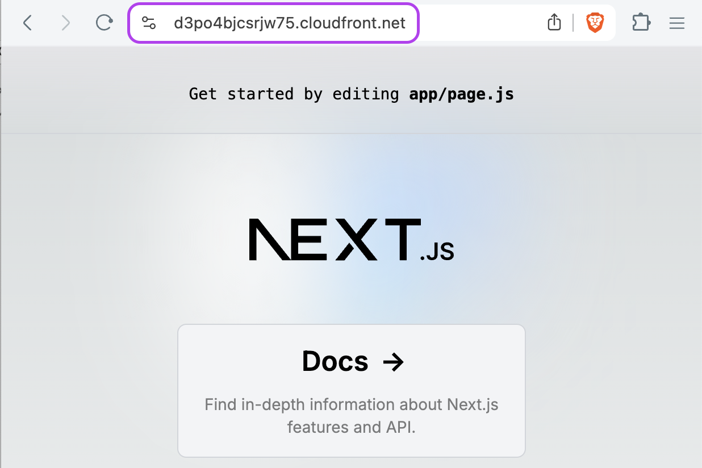

# Next.js on AWS Fargate with Terraform
 


## Architecture

See the [Terraform code](./infra/main.tf) for the full architecture.

- A VPC with public, private, private isolated subnets
- An ECS cluster with a Fargate service
- A Route 53 private hosted zone for the ECS service (AWS CloudMap/Service Discovery)
- API Gateway w/ VPC Link Integration to the ECS service using the private DNS name
- An ECS task definition with a container that runs the Next.js app
- A CloudFront distribution with an API Gateway origin

## Deploy to AWS with Terraform

First, you need to install Terraform. You can download it from [here](https://www.terraform.io/downloads.html).


```bash
cd infra
# Initialize the Terraform providers
terraform init
# See the changes that will be applied
terraform plan
# Apply the changes to your default AWS profile
terraform apply
```

You can also use a different AWS profile by setting the `AWS_PROFILE` environment variable.

```bash
AWS_PROFILE=my-profile terraform apply
```